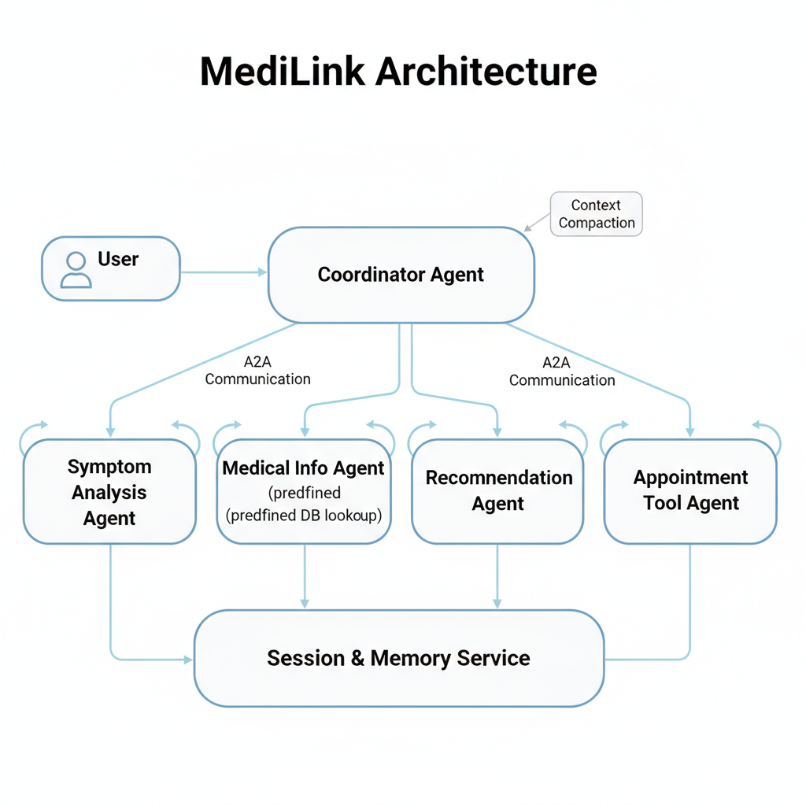

# MediLink — Multi-Agent Healthcare Assistant

**Short description**  
MediLink is an AI-powered multi-agent healthcare assistant that performs symptom triage, provides safe preliminary guidance, and manages basic medical tasks using intelligent agent collaboration.

---

## Project goal
Build a reliable prototype agentic system that demonstrates: multi-agent communication (A2A), tool-calling, sessions & memory, context compaction, observability (logging/traces), and evaluation — focused on safe, explainable, minimal-risk healthcare assistance (triage & appointment assistance).

---

## Features
- Symptom triage (structured questions → risk level)
- Appointment scheduling helper (demo; not linked to real calendar)
- Multi-agent design: Frontend agent (UI/chat), Triage agent, Knowledge agent (RAG or simple DB), and Orchestrator
- Tool-calling pattern for actions (e.g., "create_appointment", "lookup_condition")
- Sessions & short-term state (InMemorySessionService; optional DatabaseSessionService)
- Context compaction (summarize history for token efficiency)
- Local evaluation scripts to verify tool-trajectory and response quality

---

## Repo structure (suggested)
MediLink/
├─ README.md
├─ LICENSE
├─ .gitignore
├─ requirements.txt
├─ agent.py # main agent definitions (ADK or wrapper)
├─ tools.py # tool implementations (fake DB, appointment tool)
├─ runner.py # example runner to test sessions
├─ evaluate.py # local evaluation runner + sample evalset JSON
├─ notebooks/
│ ├─ demo.ipynb
│ └─ evaluation.ipynb
├─ docs/
│ ├─ architecture.png
│ └─ submission_writeup.md
├─ tests/
│   └─ integration.evalset.json

## Overview  
MediLink is a simple, safe, multi-agent healthcare assistant built for the Kaggle × Google AI Agents Intensive Capstone Project.  
It provides structured symptom guidance and appointment support using multi-agent communication, tools, memory, and context engineering.  
(Note: This is not medical advice. Only general guidance.)

---

## Problem Statement  
People often feel confused when searching online for symptoms.  
Most answers are inconsistent, unsafe, or unclear.  
MediLink solves this by offering:  
- Structured symptom understanding  
- General guidance  
- Red-flag warnings  
- Simple appointment suggestions  
- Memory-aware conversations  

---

## Solution  
MediLink uses a multi-agent system:

- **Coordinator Agent** – manages the full workflow  
- **Symptom Agent** – interprets user symptoms  
- **Medical Info Agent** – fetches safe predefined medical info  
- **Recommendation Agent** – gives simple next-step suggestions  
- **Appointment Tool** – offers basic time slot suggestions  

This design makes the agent clear, modular, and safe.

---

## Key Concepts Used (Course Requirements)  
This project implements more than 3 required ADK concepts:

- ✔ Multi-agent system  
- ✔ Custom tools  
- ✔ Sessions & memory  
- ✔ Context compaction  
- ✔ A2A protocol (agents talking to each other)  
- ✔ Evaluation using ADK  

---
## Architecture

---

## How to Run  
Install dependencies:
pip install -r requirements.txt
Run the agent:
python runner.py

---

## File Description  

| File | Description |
|------|-------------|
| agent.py | All agent definitions |
| tools.py | Tools for medical info + appointments |
| runner.py | Runs and tests the system |
| evaluate.py | Evaluation logic |
| notebooks/demo.ipynb | Example interactions |
| notebooks/evaluation.ipynb | Evaluation notebook |
| docs/architecture.png | Architecture diagram |
| docs/submission_writeup.md | Full detailed writeup |
| tests/integration.evalset.json | Evaluation test cases |

---

## Links  
GitHub Repository:https://github.com/ridhanya1515/MediLink-Agent  

